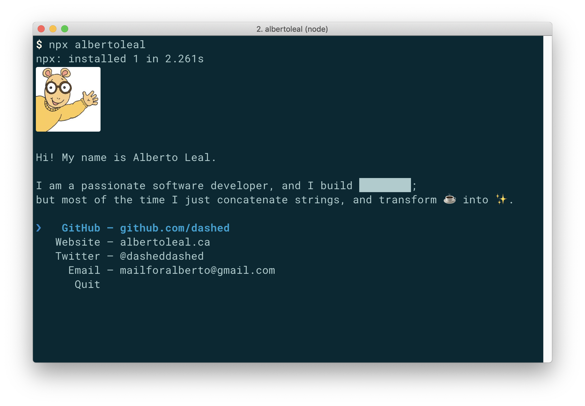

# albertoleal

> My personal npm card.

<center>
    
</center>

## Usage

Install Node.js with npm; which should come with [`npx`](https://blog.npmjs.org/post/162869356040/introducing-npx-an-npm-package-runner) to make this work:

```
npx albertoleal
```

## Credits

Blatantly stolen from https://github.com/sindresorhus/sindresorhus

Other inspiration:

- https://github.com/bnb/bitandbang

## License

MIT.
